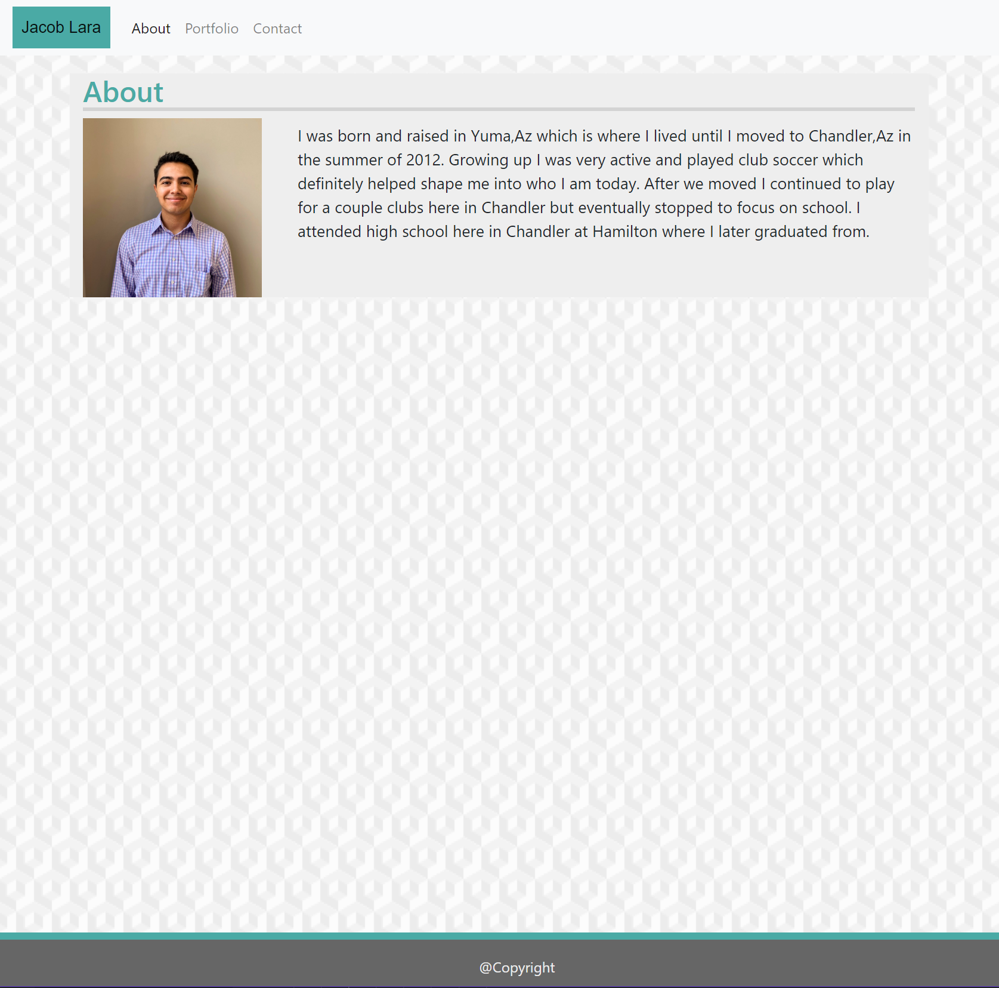
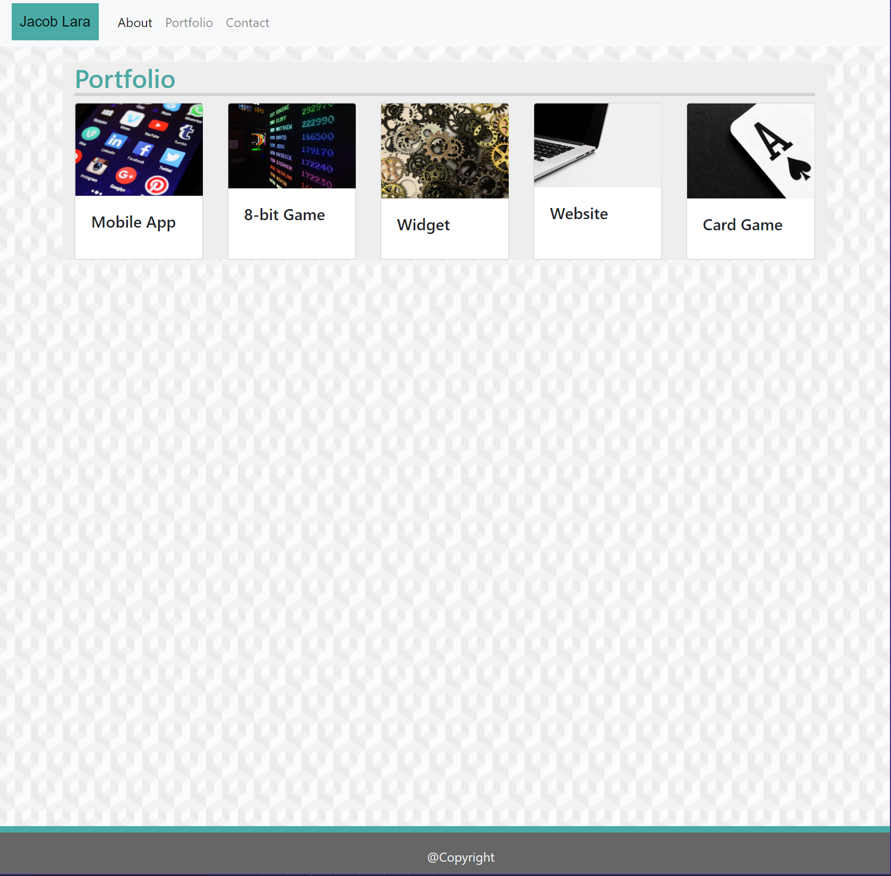
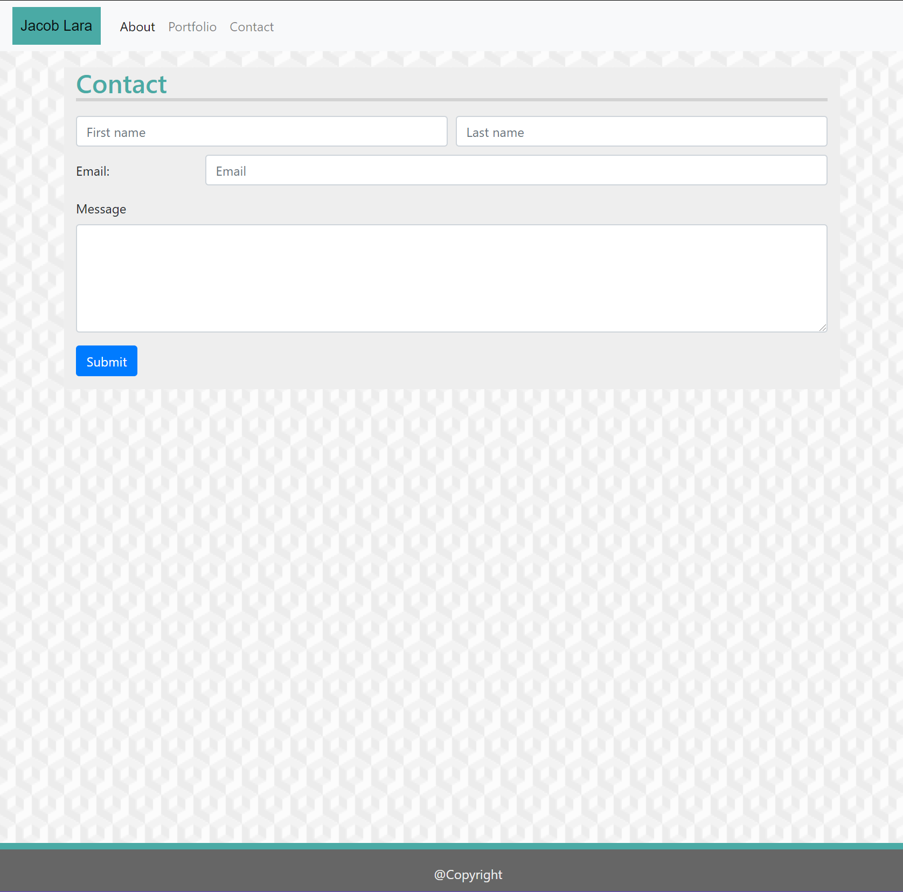

# Portfolio-Hw-2
​
### Table of Contents
- [Description](#Description)
- [Technologies-Libraries](#Technologies-Libraries)
- [Screenshots](#Screenshots)
- [Link](#Link)
​
### Description
A mobile responsive portfolio that was updated from homework 1, in order to showcase my coding progress and let visitors know a little bit about me. I made this website in order to potentially use it for future employers to see my work. 
​
### Technologies-Libraries
- [Bootstrap](https://getbootstrap.com/) - CSS Framework
​
### Screenshots
​

​

​
### Link
Check it out! 
 https://jlara97.github.io/Portfolio-Hw-2/